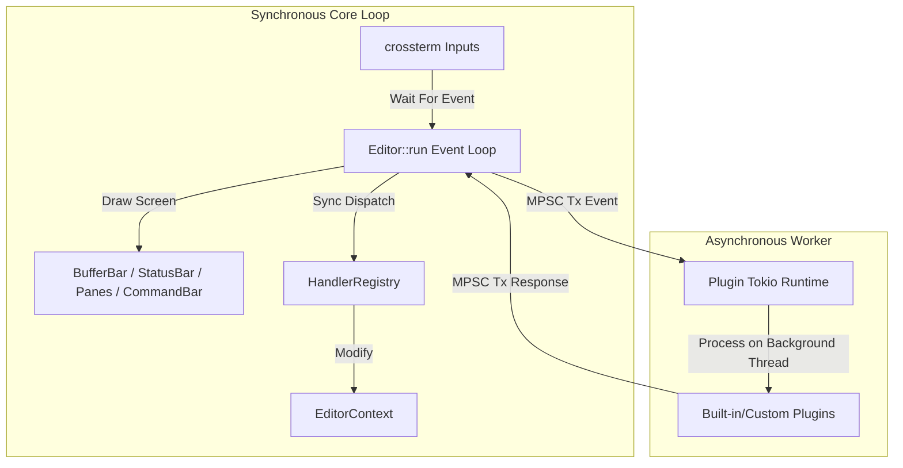
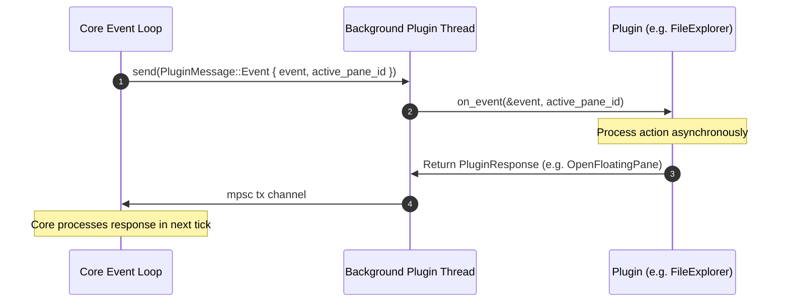

# 🌲 Yonro Terminal-Based Text Editor

[](https://github.com/akshayrivers/Text_Editorr/actions/workflows/rust.yml)

Yonro is a highly enhanced, layered, and extensible terminal-based text editor written in Rust. Originally inspired by the [Hecto tutorial](https://www.flenker.blog/hecto/), Yonro has diverged significantly to incorporate a robust **split-pane layout tree**, multi-pane floating windows, an asynchronous **plugin architecture**, an active **File Explorer plugin**, and a robust command dispatcher.


## 📸 Demos

### Multi-Pane Splitting & Floating Windows


### File Editing and Highlighting


## 🚀 Quick Start

### Requirements
*   **Rust** (stable toolchain)
*   A terminal with **UTF-8** and **grapheme support**

### Build and Run
```bash
# Clone the repository
git clone https://github.com/akshayrivers/Text_Editor.git
cd Text_Editor

# Run the editor
cargo run
```


## ⌨️ Keybindings & Controls

### Core Commands
*   `Ctrl-S`: Save current file
*   `Ctrl-Q`: Quit editor (warns if file has unsaved changes, press 3 times to force quit)
*   `Ctrl-F`: Interactive search within the active buffer (Esc to cancel, Arrows to navigate matches)
*   `Ctrl-Z`: Undo last editing step (supports word grouping on typing)
*   `Ctrl-R`: Redo last undone editing step
*   `Ctrl-E`: Toggle the built-in File Explorer floating pane
*   `Ctrl-Space`: Open the command bar for pane commands

### File Explorer Navigation
When the File Explorer pane is active:
*   `Up` / `Down` arrows: Select directory entry
*   `Enter`: Open file or traverse directory
*   `Esc`: Close File Explorer

### Split Resizing
*   Click and drag on horizontal or vertical dividers between tiled panes to resize them dynamically.


## 🏛️ Architecture & Layered Design

Yonro is built in robust layers, separating terminal rendering from state management and asynchronous operations.



### 📦 Core Components

*   **`Editor`**: Integrates layout, buffers, rendering, and coordinates with the asynchronous plugin runtime.
*   **`LayoutTree`**: A recursive binary tree structure managing horizontal and vertical pane splits.
*   **`PaneManager`**: Controls both tiled and floating panes, handles pane selection, and tracks pane depth/Z-index.
*   **`BufferManager` & `Buffer`**: Owns text data, tracks file paths, dirty flags, and performs grapheme-level file reads/writes.
*   **`View`**: The text-rendering viewport inside a text pane, managing line highlights, local cursors, and scrolling.


## 🔌 Asynchronous Plugin System

Yonro features a background plugin runtime that runs on an independent Tokio worker thread. This keeps key input latency at virtually `0ms` even if plugins perform expensive disk, LSP, or network operations.



### Message and Response Pipeline
*   **`PluginMessage`**: Propagates events (`Event { event, active_pane_id }`), buffer updates (`BufferChanged(BufferSnapshot)`), and notifications (`PaneOpened { plugin_name, pane_id }`) to the plugin runtime.
*   **`PluginResponse`**: Plugins return responses to open floating panes (`OpenFloatingPane`), close panes (`ClosePane`), shift selections (`MoveInPane`), or output logs (`UpdateMessage`).


## 🛠️ Command Bar & Window Management

Pressing **`Ctrl-Space`** opens the Pane Command Bar. The following commands can be executed:

*   **`focus <id>`** (or just **`<id>`**): Swaps active window focus to the specified pane.
*   **`close <id>`** (or just **`close`**): Closes the specified (or active) pane.
*   **`float`**: Un-tiles the active pane and turns it into a floating pane.
*   **`unfloat`**: Re-tiles a floating pane back into the Layout Tree.
*   **`explore`**: Spawns a tiled File Explorer pane on the side.


## 📄 License

Yonro is licensed under the MIT License.
inspired by hecto: https://www.flenker.blog/hecto/
